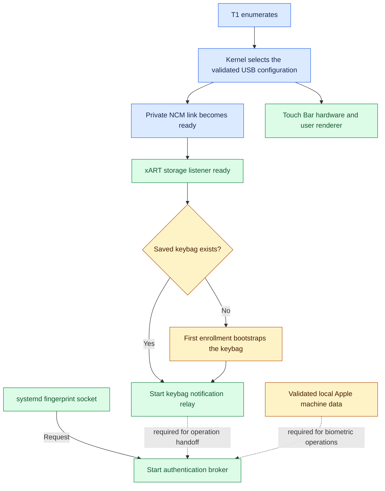
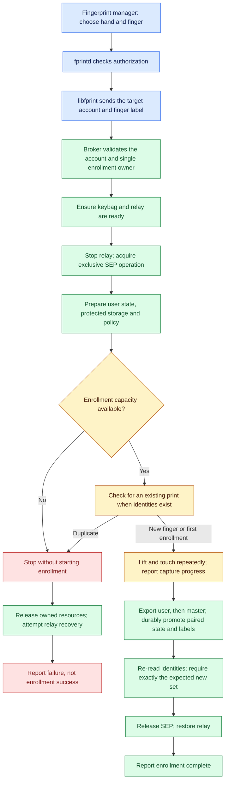
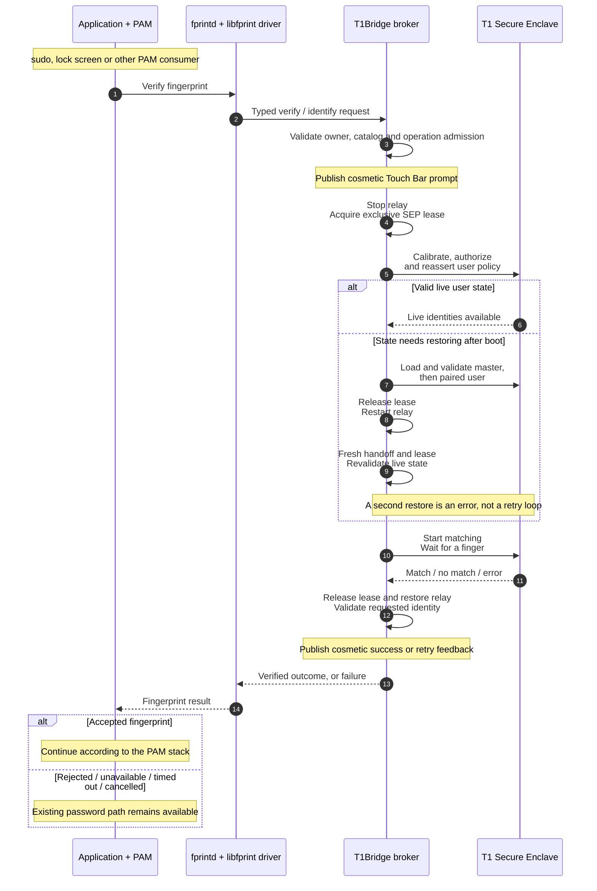

# How Touch ID works

Linux applications use **fprintd**. Its libfprint driver asks **T1Bridge** to
perform the operation; T1Bridge coordinates the **T1 Secure Enclave**, where
finger capture and matching happen. The Touch Bar displays progress and results
but cannot authorize anything.

These diagrams describe the standard fprintd path, not the direct development
CLI. They describe implementation behavior, not completed release acceptance;
see the [release gate](release-gate/v1.md) for current evidence.

## Startup: make the hardware ready

NCM is the private network link to the T1. xART stores opaque anti-replay data.
The keybag relay maintains the device's notification session between biometric
operations; it is not the fingerprint matcher. A socket can be listening even
when the hardware is not ready.

Apple machine data is imported locally from a matching preserved EFI source.
It is never shipped in a package. Protected state remains root-owned on the
machine; other users and the renderer do not receive it.

Sources: [service ordering](architecture.md#boot-and-ordering-contract),
[xART unit](../systemd/t1-xart-storage@.service),
[keybag unit](../systemd/t1bridge-keybag.service).

## Enrollment: capture, then commit

Duplicate detection and capture share the enrollment operation; the duplicate
check is not a second authorization prompt. If the keybag needs bootstrapping,
that preparation happens **before** the enrollment relay handoff—not inside the
capture lease. Authorization UI belongs to the caller's fprintd/Polkit policy;
an already privileged caller may need no further prompt.

Capture progress is not success. T1Bridge reports completion only after paired
storage, identity verification, and relay recovery succeed. Errors, timeout,
device loss, or cancellation trigger cleanup instead. A failure after device
mutation can leave protected recovery state; it does not mean nothing changed.
Do not delete state files to retry.

The backend limits new enrollment to three identities for one Linux owner. It
can still list and reduce older sets up to the device protocol's five-identity
bound. A reusable fingerprint manager must not hardcode those T1 limits.

Sources: `run_live_enroll` and `prepare_enrollment_relay` in
[live operations](../crates/t1-daemons/src/live_standard_fingerprint.rs),
[enrollment transaction](../crates/t1-daemons/src/enrollment_transaction/standard_enrollment.rs).

## Authentication: warm match or cold restore

A warm match uses one lease. A cold restore deliberately finishes its lease and
restores the relay before a second lease attempts matching. The broker allows
one active operation; another request receives Busy instead of a queued prompt.

Fingerprint failure must never lock out the password path. This depends on the
consumer's PAM configuration: T1Bridge does not edit it or guarantee that a
third-party stack is configured correctly. Password and fingerprint prompts
need not appear simultaneously.

The renderer gets only cosmetic state and may request cancellation through the
hardware service. Its pixels, animations, and progress values are never
authentication evidence. Kernel peer checks, the selected account, the saved
catalog, and the device result determine the outcome.

Sources: `complete_match_after_restore`, `run_live_match_pass`, and
`run_live_query` in [live operations](../crates/t1-daemons/src/live_standard_fingerprint.rs),
[relay handoff](../crates/t1-daemons/src/auth_lifecycle.rs),
[public interfaces](interfaces.md), [security boundaries](security-review/v1.md).
